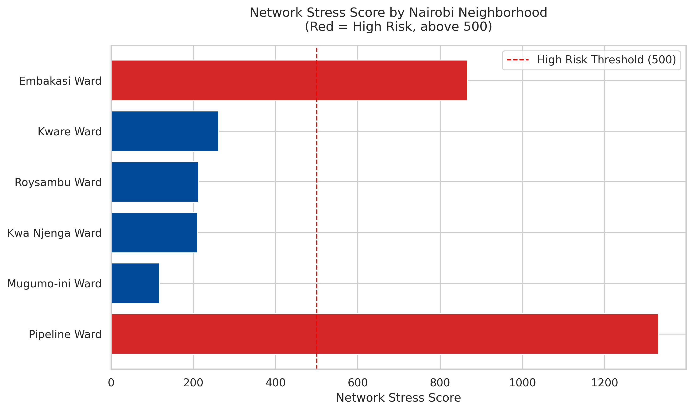
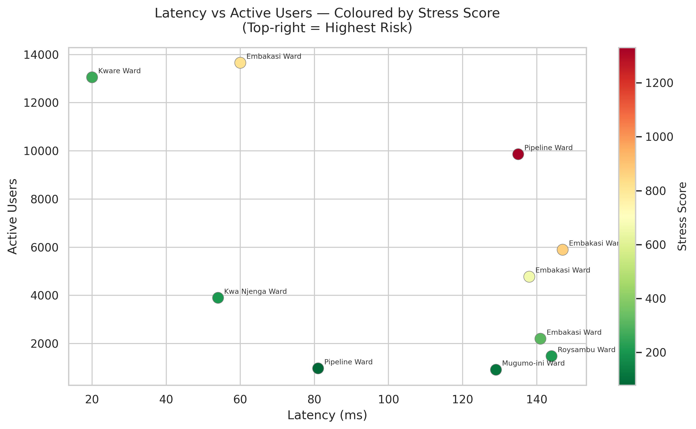

# The Urban Pulse: Nairobi Network Stress Analysis

Analyst and Author: Brightone Onyango  
 
**Tools:** Python · Pandas · Matplotlib · Seaborn · Google Colab · OpenCellID

---

## Table of Contents

1. [Project Overview](#1-project-overview)
2. [The Problem](#2-the-problem)
3. [Data Source and Dictionary](#3-data-source-and-dictionary)
4. [Step by Step Methodology](#4-step-by-step-methodology)
5. [Key Findings and Visuals](#5-key-findings-and-visuals)
6. [Strategic Recommendations](#6-strategic-recommendations)
7. [Get in Touch](#7-get-in-touch)

---

## 1. Project Overview

This project addresses a real operational challenge faced by a Kenyan telecommunications provider: the inability of regional management teams to work with raw system exports. The company collects network performance data from cell towers across Nairobi, but the data is exported in nested JSON format, a structure that cannot be opened or analysed directly in Excel or standard business intelligence tools.

The objective of this project was to build a Python transformation layer that parses the nested JSON, derives a meaningful risk metric called the Network Stress Score, and exports a clean, sorted CSV that regional managers can use immediately for decision-making.

---

## 2. The Problem

The core challenge had two dimensions:

**Structural:** The system export format used nested JSON objects. Each tower record contained a `metrics` sub-object holding latency, user density, and bandwidth data. This structure is valid for software systems but incompatible with spreadsheet tools used by non-technical stakeholders.

**Analytical:** Raw latency and user figures in isolation are not sufficient for prioritisation. A tower with high latency but very few users is far less critical than one with moderate latency serving thousands. A combined risk metric was needed to rank towers meaningfully.

---

## 3. Data Source and Dictionary

**Primary Dataset:** `keCellTowers.csv` sourced from OpenCellID, containing 78,730 cell tower records across Kenya. The dataset was filtered to Nairobi for this analysis.

**Fields Used from keCellTowers.csv:**

| Field | Description |
|---|---|
| `cell` | Unique cell identifier, used to generate Tower ID strings |
| `county` | Used to filter records for the Nairobi metropolitan area |
| `ward` | Geographic ward name, used as the neighborhood identifier |

**Simulated Network Metrics (System Export):**

Since live system telemetry was not available, network performance metrics were simulated using realistic ranges to replicate a production export scenario.

| Field | Description | Range |
|---|---|---|
| `latency_ms` | Network response time in milliseconds | 20 to 150 ms |
| `active_users` | Number of users connected to the tower | 500 to 15,000 |
| `bandwidth_usage` | Percentage of bandwidth in use | 50% to 99% |
| `status` | Tower operational status | online or maintenance |

**Derived Metric:**

| Field | Formula | Purpose |
|---|---|---|
| `Stress_Score` | `(Users × Latency) / 1000` | Quantifies combined network pressure per tower |

A high Stress Score identifies towers where high user density coincides with high latency, signalling a need for immediate capacity review or hardware upgrades.

---

## 4. Step by Step Methodology

### Step 1: Environment Setup and Data Preparation

The raw dataset was loaded and filtered for Nairobi towers. A simulated JSON system export was generated using real tower identifiers from the dataset, with mock network metrics applied to replicate a live telemetry export.

```python
import pandas as pd
import json
import numpy as np

np.random.seed(42)  # Ensures reproducible results

df_raw = pd.read_csv('keCellTowers.csv')
nairobi_towers = df_raw[df_raw['county'] == 'Nairobi'].head(10)

json_output = []
for _, row in nairobi_towers.iterrows():
    tower_entry = {
        "tower_id": f"NRB-{row['cell']}",
        "location": row['ward'],
        "metrics": {
            "latency_ms": np.random.randint(20, 150),
            "active_users": np.random.randint(500, 15000),
            "bandwidth_usage": round(np.random.uniform(50, 99), 1)
        },
        "status": "online" if np.random.random() > 0.1 else "maintenance"
    }
    json_output.append(tower_entry)

with open('network_data.json', 'w') as f:
    json.dump(json_output, f, indent=4)

print("Step 1 Complete: 'network_data.json' generated using real Nairobi Tower IDs.")
```

### Step 2: JSON Flattening and Stress Score Calculation

The nested JSON was parsed and each `metrics` sub-object was flattened into a single row structure. The Network Stress Score was calculated and appended as a derived column.

```python
with open('network_data.json', 'r') as f:
    raw_json_data = json.load(f)

processed_data = []
for entry in raw_json_data:
    flattened_row = {
        "Tower_ID": entry['tower_id'],
        "Neighborhood": entry['location'],
        "Status": entry['status'],
        "Latency": entry['metrics']['latency_ms'],
        "Users": entry['metrics']['active_users'],
        "Bandwidth_Pct": entry['metrics']['bandwidth_usage']
    }
    flattened_row['Stress_Score'] = round(
        (flattened_row['Users'] * flattened_row['Latency']) / 1000, 2
    )
    processed_data.append(flattened_row)

analysis_df = pd.DataFrame(processed_data)
analysis_df.head()
```

### Step 3: Validation and CSV Export

The final DataFrame was sorted by Stress Score in descending order so the highest risk towers appear first. The report was exported as a CSV for immediate use by regional managers.

```python
final_report = analysis_df.sort_values(by='Stress_Score', ascending=False)

final_report.to_csv('nairobi_network_stress_report.csv', index=False)

print("Step 3 Complete: CSV generated for Regional Managers.")
print(final_report[['Neighborhood', 'Users', 'Stress_Score']].head())
```

### Step 4: Visualisation

Two charts were produced to communicate the findings to both technical and non-technical audiences.

```python
import matplotlib.pyplot as plt
import seaborn as sns

sns.set_theme(style="whitegrid")
plt.rcParams['figure.dpi'] = 300

# Chart 1: Horizontal Bar Chart
fig, ax = plt.subplots(figsize=(10, 6))
sorted_df = final_report.sort_values(by='Stress_Score', ascending=True)
ax.barh(
    sorted_df['Neighborhood'],
    sorted_df['Stress_Score'],
    color=['#d62728' if score > 500 else '#004a99' for score in sorted_df['Stress_Score']],
    edgecolor='white'
)
ax.set_xlabel('Network Stress Score', fontsize=12)
ax.set_title('Network Stress Score by Nairobi Neighborhood', fontsize=13, pad=15)
ax.axvline(500, ls='--', color='red', linewidth=1.2, label='High Risk Threshold (500)')
ax.legend()
plt.tight_layout()
plt.savefig('chart1_stress_score_by_neighborhood.png', bbox_inches='tight')
plt.show()

# Chart 2: Scatter Plot
fig, ax = plt.subplots(figsize=(10, 6))
scatter = ax.scatter(
    final_report['Latency'],
    final_report['Users'],
    c=final_report['Stress_Score'],
    cmap='RdYlGn_r',
    s=120,
    edgecolors='grey',
    linewidths=0.5
)
for _, row in final_report.iterrows():
    ax.annotate(row['Neighborhood'], (row['Latency'], row['Users']),
                textcoords="offset points", xytext=(6, 4), fontsize=7)
cbar = plt.colorbar(scatter, ax=ax)
cbar.set_label('Stress Score', fontsize=11)
ax.set_xlabel('Latency (ms)', fontsize=12)
ax.set_ylabel('Active Users', fontsize=12)
ax.set_title('Latency vs Active Users, Coloured by Stress Score', fontsize=13, pad=15)
plt.tight_layout()
plt.savefig('chart2_latency_vs_users.png', bbox_inches='tight')
plt.show()
```

---

## 5. Key Findings and Visuals

### Chart 1: Network Stress Score by Neighborhood



*Towers coloured red exceed the high risk threshold of 500. These require immediate capacity review.*

### Chart 2: Latency vs Active Users



*Towers in the top-right corner carry both high latency and high user load, making them the most stressed on the network. Neighbourhood labels identify the specific areas requiring intervention.*

### Technical Decision Log

**Data Source:** OpenCellID Kenya dataset (`keCellTowers.csv`) used to map real cell identifiers across Nairobi wards.

**Challenge:** The input format was nested JSON, which prevents direct calculation in standard BI tools used by regional managers.

**Solution:** A Python transformation layer was built to flatten the `metrics` object and derive a custom `Stress_Score` combining user density and latency into a single actionable number.

**Logic Applied:** A high Stress Score identifies towers where high latency coincides with high user density, signalling a need for hardware capacity upgrades or network load balancing.

---

## 6. Strategic Recommendations

**Immediate Capacity Review**  
Towers with a Stress Score above 500 should be flagged for immediate infrastructure assessment. High scores indicate that the current hardware is likely insufficient to serve the volume of active users without degrading service quality.

**Maintenance Scheduling**  
Towers currently marked as `maintenance` should be cross-referenced with high-stress neighborhoods to determine whether downtime is contributing to overload on neighbouring towers.

**Expand the Dataset**  
This analysis used 10 Nairobi towers as a proof of concept. Scaling the pipeline to all 31,515 Nairobi tower records in the dataset would provide a comprehensive city-wide risk map for the provider.

**Automate the Pipeline**  
Transition this Google Colab prototype into a scheduled automation that ingests live telemetry exports, recalculates Stress Scores weekly, and delivers an updated CSV report to regional managers automatically.

---

*Report prepared by Brightone Onyango, Data Automation Specialist and Technical Writer.*

---

## 7. Get in Touch

Feel free to reach out for further discussions regarding this analysis or other data engineering projects.

- **LinkedIn:** [Brightone Onyango](https://www.linkedin.com/in/brightone-onyango-109614263)
- **GitHub:** [georgixxx](https://github.com/georgixxx)
- **Email:** [georgebrixomuga@gmail.com](mailto:georgebrixomuga@gmail.com)
- **Portfolio:** [georgixxx.github.io](https://georgixxx.github.io)

[Back to Main Portfolio Website](https://georgixxx.github.io)
